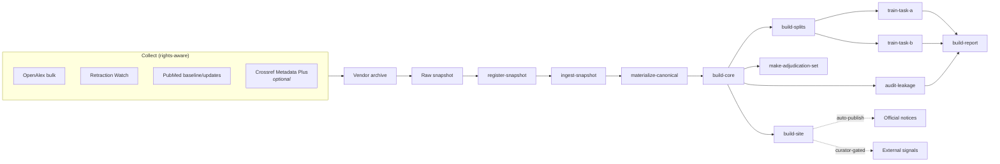

# Life-Science Integrity Signals Benchmark

[](https://github.com/jang1563/Retracted_concern_DB/actions/workflows/ci.yml)
[](https://jang1563.github.io/Retracted_concern_DB/)
[](LICENSE)
[](#)

**Live demo:** [jang1563.github.io/Retracted_concern_DB](https://jang1563.github.io/Retracted_concern_DB/) — the evidence browser built from the synthetic sample corpus, auto-deployed from every commit to `main`.

A **triage-benchmark harness** for ranking life-science papers for human integrity review.

> **This is not a fraud detector.** It does not determine misconduct. It ranks papers for human reviewers and aggregates evidence with explicit rights and provenance handling. Every downstream decision requires a named human reviewer. See [ETHICS.md](ETHICS.md).

<!-- LSIB_STATUS_START -->
Status: **v0.1 scaffold, v0.2 real-data release in progress.** The full stack runs end-to-end on synthetic sample data — 78 tests pass, the `demo` pipeline produces a complete release + static site in seconds, and the release artifacts now include validity-gated grouped-holdout robustness runs, calibration curves, PR curves, operating-point metrics, and bootstrap AUPRC confidence intervals. A real-data release built from OpenAlex, Retraction Watch, and PubMed is currently running on Cayuga; real numbers will land in a tagged release once the downstream job completes. See [docs/results.md](docs/results.md) for the current demo numbers and [docs/results_v0.2.md](docs/results_v0.2.md) for the real-data results draft.
<!-- LSIB_STATUS_END -->

<!-- LSIB_RELEASE_SNAPSHOT_START -->
## Release Snapshot

The real-data open-data-only release is still running on Cayuga. When it completes, this section will be replaced with headline release metrics generated from the harvested `artifacts/open_data_release/` bundle. Until then, see [docs/results.md](docs/results.md) for the synthetic demo numbers and [docs/results_v0.2.md](docs/results_v0.2.md) for the real-data results draft.
<!-- LSIB_RELEASE_SNAPSHOT_END -->

---

## Why This Exists

Research-integrity signals — retractions, corrections, expressions of concern, paper-mill watchlists, community flags — arrive **late**, **fragmented across sources**, and **carry real reputational consequences** when mishandled. Most existing tooling either (a) aggregates signals without rights controls, (b) produces public "risk scores" that get quoted out of context, or (c) ignores leakage between publication-time features and post-publication evidence.

This repository is an attempt at the opposite: a **benchmark and protocol** for evaluating triage models that are rights-aware, leakage-audited, and governance-gated by design.

## What Is In The Box

1. **Two task definitions.**
   - **Task A** — publication-time ranking. Predict whether a paper will receive a public integrity signal or official notice within a `12m` or `36m` horizon, using only features available at publication time. [docs/evaluation_protocol.md](docs/evaluation_protocol.md)
   - **Task B** — snapshot-time evidence aggregation. Assign `notice_status` and issue tags from provenance-permitted evidence visible at the snapshot date.
2. **Leakage-audited splits.** Time-based primary split, grouped holdouts for author cluster / venue / publisher, a `noisy-date` analysis split, and an `audit-leakage` CLI step that checks feature cutoff dates.
3. **Rights-aware ingest.** Collectors for OpenAlex bulk, Retraction Watch, PubMed baseline+updatefiles, and optional Crossref Metadata Plus, staged through a vendor archive → raw snapshot → canonical release pipeline. Link-only sources stay link-only. [docs/source_rights_matrix.md](docs/source_rights_matrix.md)
4. **A read-only evidence browser.** Static site with policy, change log, dispute workflow, and adjudication protocol pages. Auto-publishes official notices; curator-gates non-notice signals. [docs/governance_policy.md](docs/governance_policy.md)
5. **Offline-first demo.** The full pipeline runs on synthetic sample data with zero network calls, so you can reproduce the scaffold end-to-end in a laptop-minute.

## Architecture



## 60-Second Demo

Synthetic sample data ships with the repo. Produce a full release + static site offline:

```bash
PYTHONPATH=src python3 -m life_science_integrity_benchmark.cli demo
```

Or run each stage separately:

```bash
PYTHONPATH=src python3 -m life_science_integrity_benchmark.cli bootstrap-sample
PYTHONPATH=src python3 -m life_science_integrity_benchmark.cli build-core
PYTHONPATH=src python3 -m life_science_integrity_benchmark.cli build-splits
PYTHONPATH=src python3 -m life_science_integrity_benchmark.cli audit-leakage
PYTHONPATH=src python3 -m life_science_integrity_benchmark.cli train-task-a
PYTHONPATH=src python3 -m life_science_integrity_benchmark.cli train-task-b
PYTHONPATH=src python3 -m life_science_integrity_benchmark.cli make-adjudication-set
PYTHONPATH=src python3 -m life_science_integrity_benchmark.cli build-site
PYTHONPATH=src python3 -m life_science_integrity_benchmark.cli build-report
```

Artifacts land in [artifacts/sample_release/](artifacts/) and [artifacts/site/](artifacts/).

Real-data and HPC collection workflows are documented in [docs/operations.md](docs/operations.md).

## What The Demo Produces

A clean `demo` run on the 16-record synthetic corpus produces:

- **Benchmark release** — `benchmark_v1.jsonl` + `.csv`, 16 records, snapshot 2026-04-09, 6 public + 5 curator-review + 5 none-known.
- **Leakage audit** — **PASS** with zero violations across 11 banned field classes and 14 publication-time Task A features. See [leakage_report.json](artifacts/sample_release/leakage_report.json) after running the demo.
- **11 split manifests** — primary time split + validity-gated venue / publisher holdouts for Task A 12m, Task A 36m, and Task B, plus noisy-date Task A analysis splits. One-record author-cluster holdouts are skipped on the synthetic corpus.
- **Task A baselines** — 3 models × 2 horizons × all metrics (AUPRC, bootstrap 95% CI, Precision@1%, Recall@1%, Precision@5%, Recall@5%, ECE, subfield-AUPRC), plus calibration and PR-curve SVGs. On the 36m horizon: metadata_logistic AUPRC=0.92, text hashing 0.81, fusion 0.92.
- **Task A robustness** — every baseline also runs across 6 valid split manifests (primary + venue / publisher holdouts × 2 horizons), producing `task_a_robustness.json`. This is how generalization-under-distributional-shift gets measured instead of just claimed; skipped holdout columns are reported as `-`.
- **Task B baseline** — keyword-rules-over-provenance; notice accuracy 1.00, tag macro-F1 0.98, provenance coverage 0.69 on the synthetic set.
- **Evidence browser site** — landing page with search, governance disclaimer, per-record pages, policy, and change log; non-notice signals are held in `internal_curation_queue.json` off the public site.
- **Experiment report** — both Markdown and JSON.

Full numbers, tables, and interpretation: [docs/results.md](docs/results.md).

> These are **synthetic-data protocol numbers** — they prove every stage of the pipeline runs and produces the expected artifact shape, not that any particular model is good. Real-data results will replace them in a future release.

## Governance And Rights (Hard Rules)

These are guardrails, not defaults. They are not optional in any release of this benchmark or in public-facing work built on it.

- Negative state is **`none_known_at_snapshot`**, never "clean." Absence of a signal does not imply integrity.
- Public site pages **never** display numeric risk scores.
- Official notices **may** auto-publish with source-linked factual summaries.
- Non-notice external signals **require curator review** before public display.
- Extension signals are **link-only** unless explicit redistribution rights exist.
- `year_imputed` publication dates are **excluded** from the primary Task A benchmark and routed to a noisy-date analysis split.
- Every release carries a **snapshot date, change log, and dispute contact**.

Full governance: [docs/governance_policy.md](docs/governance_policy.md). Ethics and non-goals: [ETHICS.md](ETHICS.md).

## Documentation Map

| Document | Purpose |
| --- | --- |
| [docs/data_card.md](docs/data_card.md) | Unit of analysis, scope, labels, leakage controls |
| [docs/evaluation_protocol.md](docs/evaluation_protocol.md) | Task A / Task B, splits, metrics, audit requirements |
| [docs/governance_policy.md](docs/governance_policy.md) | Public display and curator rules |
| [docs/source_rights_matrix.md](docs/source_rights_matrix.md) | What can be redistributed and how |
| [docs/adjudication_protocol.md](docs/adjudication_protocol.md) | Review policy for weak labels and wording |
| [docs/raw_source_schema.md](docs/raw_source_schema.md) | Raw snapshot layout |
| [docs/real_data_source_examples.md](docs/real_data_source_examples.md) | Concrete examples per source family |
| [docs/results.md](docs/results.md) | Demo-run numbers and artifact shapes |
| [docs/operations.md](docs/operations.md) | Real-data collection, HPC, release builds |
| [docs/cayuga_overnight_run.md](docs/cayuga_overnight_run.md) | HPC rehearsal runbook |
| [ETHICS.md](ETHICS.md) | Intended use and non-goals |
| [SECURITY.md](SECURITY.md) | Responsible disclosure |
| [CONTRIBUTING.md](CONTRIBUTING.md) | How to contribute (governance-gated) |
| [CODE_OF_CONDUCT.md](CODE_OF_CONDUCT.md) | Expected behavior |

## Project Layout

- [src/life_science_integrity_benchmark/](src/life_science_integrity_benchmark/) — package code
- [scripts/raw_snapshot/](scripts/raw_snapshot/) — vendor-archive collection, validation, staging helpers
- [scripts/cayuga/](scripts/cayuga/) — HPC submission and monitoring helpers
- [docs/](docs/) — data card, evaluation protocol, rights matrix, governance, runbooks
- [tests/](tests/) — dataset logic, auditing, modeling, site generation

## Model Backends

The repository runs fully offline with built-in pure-Python baselines. The abstract-text encoder baseline can optionally use a locally cached Transformer model; the metadata baseline can optionally use XGBoost if available. Neither is required for the default demo path.

## Status And Roadmap

- [x] End-to-end scaffold with synthetic sample data
- [x] Rights-aware vendor-archive → raw-snapshot → canonical release pipeline
- [x] Leakage-audited Task A / Task B split construction
- [x] Read-only evidence browser with dispute workflow
- [x] HPC (Cayuga) rehearsal runbook
- [ ] First real-data release (OpenAlex + Retraction Watch + PubMed, Crossref skipped)
- [ ] Baseline numbers against the real-data release
- [ ] Adjudicated subset with double-review consensus fields
- [ ] v0.2 tagged release with Zenodo DOI

## License

Apache License 2.0 — see [LICENSE](LICENSE). License covers the code and the structure of releases produced by this repository. Individual source fields redistributed inside a release remain subject to their upstream licenses; see the rights matrix.

## Citation

See [CITATION.cff](CITATION.cff). If you use this benchmark in published work, please also cite the upstream data sources per their terms.
